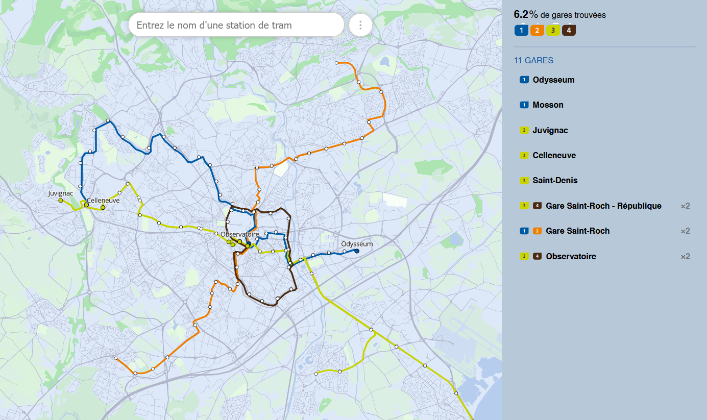

Memory pour Montpellier
=======================



[**Jouer**](https://eliemichel.github.io/MemoryMontpellier) | [**Code Source**](https://github.com/eliemichel/MemoryMontpellier)

*(English description below)*

Inspiré par le [Memory pour Paris](https://memory.pour.paris) de [Benjamin TD](https://twitter.com/_benjamintd), lui-même inspiré par [Chris Arvin](https://carvin.github.io/sf-street-names/) pour San Fransisco, voici la version montpelliéraine !

Un grand merci à eux pour l'inspiration, amusez-vous bien et n'hésitez pas à faire des retours via [le système d'issues de GitHub](https://github.com/eliemichel/MemoryMontpellier/issues) et à partager.

Voir aussi ma version étendue à l'Île-de-France: [Mémory pour l'Ïle-de-France](https://eliemichel.github.io/MemoryIDF/)

Crédits
-------

*Merci à:*

 - [Élie Michel](http://eliemichel.fr) pour le développement.
 - [Benjamin TD](https://twitter.com/_benjamintd) pour l'inspiration.
 - [Chris Arvin](https://twitter.com/chrisarvinsf) pour l'inspiration de Benjamin.
 - [Montpellier Méditerrannée Métropole](https://data.montpellier3m.fr/) pour ses données ouvertes.
 - Toutes celles et ceux qui ont fait des retours pour améliorer le jeu!

What is this?
-------------

Inspired by the [Memory pour Paris](https://memory.pour.paris) from [Benjamin TD](https://twitter.com/_benjamintd), itself inspired by [Chris Arvin](https://carvin.github.io/sf-street-names/) and their San Fransisco game, here is a version for Montpellier!

A warm thank to them for the inspiration, please enjoy the game and feel free to provide feedback through [GitHub issues](https://github.com/eliemichel/MemoryMontpellier/issues) and to share around.

Also check out my version for the whole Île-de-France (Paris metropolitan area): [Mémory pour l'Ïle-de-France](https://eliemichel.github.io/MemoryIDF/)

Hacking
-------

If you want to update data, you need to first get them:

```
python scripts\download_raw_data.py
python scripts\preprocess_data.py
```

If you want to run this game locally, all you need is to serve a local server from this directory:

```
python -m http.server
```

**NB:** If you want to host a variant somewhere else, you will need to modify the MapBox API key.

License
-------

This project is shared under the terms of the simple MIT license:

```
Copyright 2023 Élie Michel

Permission is hereby granted, free of charge, to any person obtaining a copy of this software
and associated documentation files (the “Software”), to deal in the Software without
restriction, including without limitation the rights to use, copy, modify, merge, publish,
distribute, sublicense, and/or sell copies of the Software, and to permit persons to whom the
Software is furnished to do so, subject to the following conditions:

The above copyright notice and this permission notice shall be included in all copies or
substantial portions of the Software.

THE SOFTWARE IS PROVIDED “AS IS”, WITHOUT WARRANTY OF ANY KIND, EXPRESS OR IMPLIED, INCLUDING
BUT NOT LIMITED TO THE WARRANTIES OF MERCHANTABILITY, FITNESS FOR A PARTICULAR PURPOSE AND
NONINFRINGEMENT. IN NO EVENT SHALL THE AUTHORS OR COPYRIGHT HOLDERS BE LIABLE FOR ANY CLAIM,
DAMAGES OR OTHER LIABILITY, WHETHER IN AN ACTION OF CONTRACT, TORT OR OTHERWISE, ARISING FROM,
OUT OF OR IN CONNECTION WITH THE SOFTWARE OR THE USE OR OTHER DEALINGS IN THE SOFTWARE.
```
